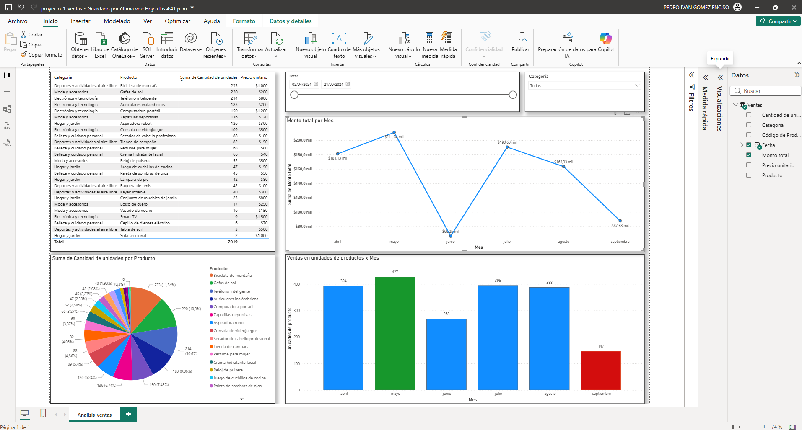

# 📈 Análisis de Ventas

## Objetivo

Analizar el comportamiento de las ventas para identificar tendencias, productos destacados y oportunidades de mejora.

## Preguntas de negocio

- ¿Cuál fue el mes con más ventas?
- ¿Cuál fue el mes con mayor facturación?
- ¿Cuáles fueron los productos más vendidos?
- ¿Qué tendencia presentaron las ventas?

## Herramientas

- Power BI

## Dashboard

## 🌐 Dashboard en línea

[📊 Ver Dashboard Interactivo](https://app.powerbi.com/view?r=eyJrIjoiMjlmNGIwNjctMjllMC00ZTQwLTkzMjQtZTM5NWQ2Nzc0NTJkIiwidCI6IjA3ZGE2N2EwLTFmNDMtNGU4Yy05NzdmLTVmODhiNjQ3MGVlNiIsImMiOjR9)

## Archivos

- proyecto_1_ventas.pbix
- Venta+de+Productos+en+Línea.csv
